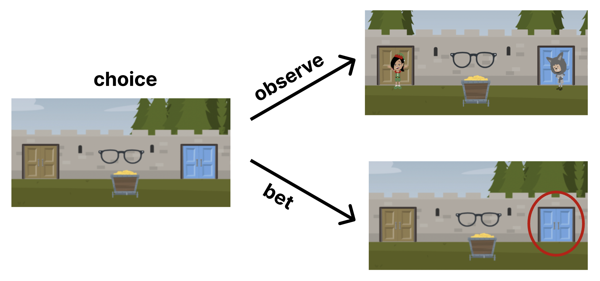

# To observe or to bet? Investigating purely exploratory and purely exploitative actions in children, adults, and computational models.

[Eunice Yiu*](https://ey242.github.io/), [Kai Sandbrink*](https://www.psy.ox.ac.uk/people/kai-sandbrink), [Alison Gopnik](http://alisongopnik.com/)

[[`CogSci2024`](https://escholarship.org/uc/item/2x7300qr)] [[`BibTeX`](#Citing)]

## Abstract

Autonomous agents often need to decide between choosing actions that are familiar and have previously yielded positive results (exploitation) and seeking new information that could help uncover more effective actions (exploration). We present an “observe or bet” task that separates “pure exploration” from “pure exploitation”: 75 five-to-seven-year-old children, 60 adults and computational agents have to decide either to observe an outcome without reward, or to bet on an action without immediate feedback at varying probability levels. Their performances were measured against solutions from the partially observable Markov decision process and meta-RL models. Children and adults tended to choose observation more than both algorithm classes would suggest. Children also modulated their betting policy based on the probability structure and amount of evidence, exhibiting “hedging behavior” a strategy not evident in standard bandit tasks. The results provide a benchmark for reasoning about reward and information in humans and neural network models.


<div align="center">
    
</div>
In this experiment, participants choose either to bet on which of two doors hides the reward, or to observe both the reward and non-reward as the doors are revealed—without earning any reward.

## Running the Experiment

To run the experiment, launch `OVB0104_zoom.html` on an Internet browser. All relevant stimuli to the experiment are included in the `public` folder.

## <a name="Citing"></a>Citing Observe-Bet

```BibTeX
@inproceedings{yiu2024observe,
  title={To observe or to bet? Investigating purely exploratory and purely exploitative actions in children, adults, and computational models.},
  author={Yiu, Eunice and Sandbrink, Kai J and Gopnik, Alison},
  booktitle={Proceedings of the Annual Meeting of the Cognitive Science Society},
  volume={46},
  year={2024}
}
```
